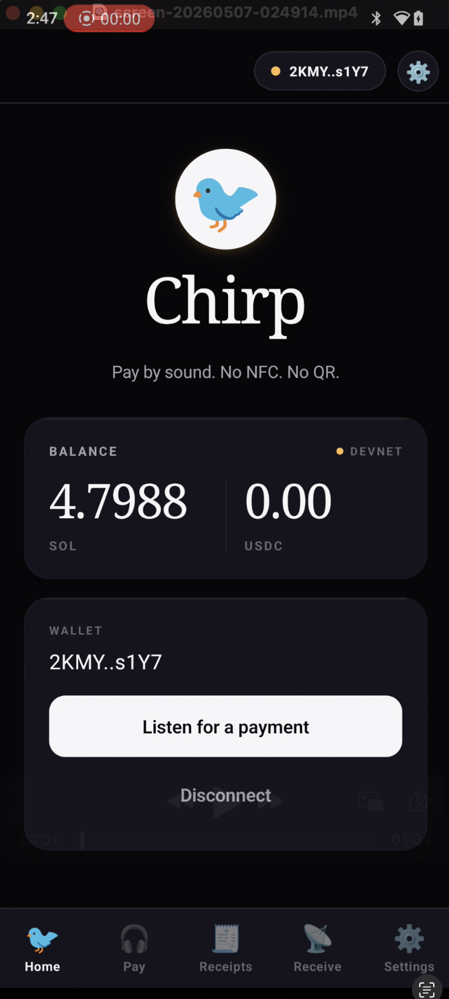
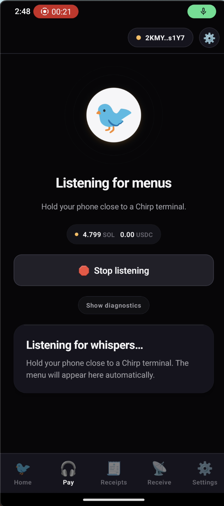
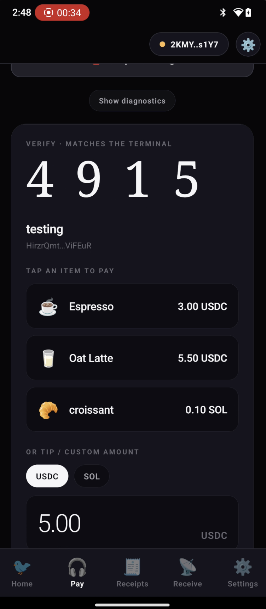
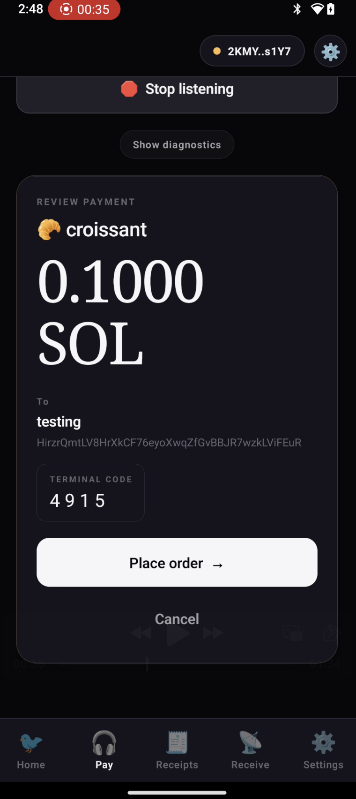
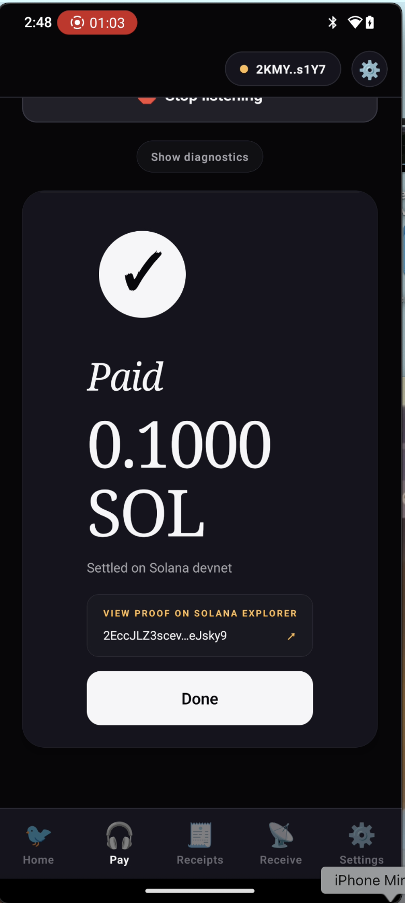

# Chirp. Pay by sound, on Solana

> **Solana Frontier Hackathon submission.** Built for Solana Mobile Seeker, runs on any Android.

**Demo video:** https://youtu.be/9eUoUFxS3XQ

## What it is

**Chirp is a Solana payments app where money moves between two devices that can hear each other.**

A merchant terminal (web) chirps a short, opaque payment ID over ultrasonic audio that everyone within a few feet hears as a brief bird-like trill. Any phone running Chirp picks up that chirp through its microphone, decodes it, fetches the merchant's menu and price options, and lets the customer pick what they want. The phone then chirps back the order to the cashier — so the cashier sees the order land on screen — and signs the Solana transaction via Mobile Wallet Adapter (Seed Vault on Seeker, Phantom or any MWA-compatible wallet on other Android devices). Funds settle in under a second.

It feels like Apple Pay, but instead of NFC it uses sound — so it works without tapping, without QR codes, without pairing, without exchanging wallet addresses. Anyone in earshot can pay anyone in earshot. Inaudible by default, audibly cute when you want it to be.

### The insight

In-person payments solve two problems at once: **proximity binding** ("this customer is paying this terminal") and **settlement** (actually moving the money). NFC and QR codes conflate them. They don't have to be. Chirp uses **sound for proximity** and **Solana for settlement**. The two layers don't need to know about each other — and decoupling them is what lets *one* terminal serve *many* phones in earshot simultaneously, which neither NFC (1:1 tap) nor BLE (1:1 pairing) can do.

---

## Why people would want to use it

- **No NFC, no QR codes, no Bluetooth pairing.** If two phones can hear each other, they can transact. Works through cracked screens, gloves, or one-handed.
- **One terminal, many payers.** A coffee-shop cashier broadcasts once and everybody in the line can pay independently. A street performer puts a tip jar terminal on a phone and dozens of phones around them can hear it. NFC and BLE are point-to-point; sound is broadcast.
- **Real Solana, non-custodial.** Every payment is a real on-chain transaction. Customer signs with their own wallet via Mobile Wallet Adapter (Seed Vault on Seeker, Phantom on other Android). Merchant never holds the funds. SOL or USDC supported today; any SPL token in principle.
- **Verifiable.** Each completed payment shows a tappable signature that opens Solana Explorer — useful both as a receipt and as proof to the merchant.
- **Built for Solana Mobile.** Designed around the Seeker's strengths: Seed Vault as the signing root, MWA as the protocol, and the device's better-than-laptop microphone and speaker for clean ultrasonic capture.

## Why it fits Solana

Chirp is software that only makes sense **in physical space** — the transport (sound) is bounded by physical proximity, so the protocol *can't* work unless two devices are actually near each other. It's a digital primitive whose meaning derives from a real-world constraint.

Concrete in-person scenarios we've designed around:
- **Counter-service retail** — cashier broadcasts, customers in line pay independently
- **Street performers / buskers / tip jars** — one terminal, no setup for tippers
- **Events and pop-ups** — vendors with no card reader, no merchant account
- **Inter-person payment without exchanging addresses** — friends split a bill by both holding phones near the terminal that's already there

### Crypto-accessibility wedge

The cashier flow at [terminal-web/app/page.tsx](terminal-web/app/page.tsx) is the part you can quietly underestimate. A merchant who has never heard of Solana taps one button — Chirp generates a wallet client-side, saves keys to the device, names the shop, and they're charging in under thirty seconds. No card reader. No app store. No KYC. No POS partnership. *Any laptop is a terminal.* Existing on-chain payment apps either (a) ride a card network, which means custody and chargeback cost, or (b) require the merchant to already own POS hardware that supports a kernel update. Chirp's bet is that the cheapest unit of distribution is the device people already own.

## For judges (start here)

- **[PROTOCOL.md](PROTOCOL.md)** — full audio protocol spec (frame layout, tone band, Goertzel decoder, error model, security)
- **Demo video** — [youtu.be/9eUoUFxS3XQ](https://youtu.be/9eUoUFxS3XQ)
- **Setup walkthrough** — [instructions.md](instructions.md)
- **Prebuilt APK** — [Releases](../../releases) (`v0.1.0-demo`)

---

## Screenshots

| Home | Listening | Menu | Review | Paid |
| --- | --- | --- | --- | --- |
|  |  |  |  |  |

---

## How the protocol works

```
   Web terminal               Relay (Hono)            Mobile (Expo + Seeker)
   ───────────────             ──────────────          ──────────────────────
   Cashier configures menu     /sessions, /intents     "Pay" tab listens via mic →
   + wallet, taps "Broadcast"  /orders, /lookup        decodes chirp →
                               /chirp/* (dev relay)    fetches session/menu →
   Emits chirp every 5 s ──── ultrasonic air sound ──► customer picks item →
   Mic listens for orders ◄── ultrasonic air sound ─── phone chirps order back →
   Decoded order pops          /orders/:id/settle     MWA → Seed Vault sign →
   on screen with item                                tx submits via Helius →
   Paid overlay + bird chime                          green check + Explorer link
```

**Two layers:**

1. **Audio chirp** — 4-tone FSK in the 19–20.5 kHz band (above adult hearing). 50 ms per symbol, 6-symbol preamble + 44-symbol payload (11 bytes) + 2-symbol postamble. CRC16-CCITT. Pure JS, runs identically on web (Web Audio API) and mobile (`react-native-audio-api`). Each chirp is prefaced with a short audible bird trill — three FM glide pulses at 2.8–4.6 kHz — that's just brand and "something happened" feedback; data still travels in ultrasonic.
2. **Relay** — a tiny Hono HTTP server (`chirp/relay-server/`) where the chirp payload lives. The 11-byte chirp carries an opaque 8-character ID; both sides resolve that ID via `/lookup/:id` to a session, intent, or order with full context (merchant pubkey, menu items, item picked, payer pubkey, etc.). In-memory store with TTL — fine for the hackathon, would map cleanly to KV on Vercel.

---

## Repo layout

```
.
├── README.md
├── chirp/                             ← Mobile app (Expo SDK 52, RN 0.76.9)
│   ├── App.tsx
│   ├── app.json                       ← name=Chirp, plugins, perms
│   ├── eas.json
│   ├── src/
│   │   ├── components/ui/             ← Glass, BirdLogo, PopButton, Card, BalanceCard
│   │   ├── navigators/                ← bottom tabs (Home / Pay / Receipts / Receive / Settings)
│   │   ├── screens/                   ← all 5 screens
│   │   ├── services/audio/            ← FSK encoder/decoder + audio channel + tests
│   │   ├── services/                  ← chirp payload, relay client, payment tx builder
│   │   ├── utils/                     ← haptics, fonts, useBalance, receipts, MWA helpers
│   │   ├── theme.ts                   ← graphite + bone + amber palette
│   │   └── polyfills.ts
│   └── relay-server/                  ← Hono HTTP relay (sessions/intents/orders/chirp)
│
└── terminal-web/                      ← Merchant terminal (Next.js 16, App Router)
    ├── app/
    │   ├── page.tsx                   ← onboarding (create or paste wallet)
    │   ├── terminal/page.tsx          ← menu builder + broadcast + mic listener + overlays
    │   └── layout.tsx                 ← Geist Sans + Instrument Serif via next/font
    ├── components/                    ← BirdLogo, BalancePanel
    └── lib/                           ← FSK, chirp, relay client, audioEmitter (with bird trill),
                                         audioListener (mic + Goertzel), wallet utils, theme
```

---

## Try the demo (judges / quick path)

If you just want to run Chirp end-to-end without modifying code:

1. **Get the customer APK.** Either download from this repo's [Releases](../../releases) (when a prebuilt APK is attached), or build one yourself: `cd chirp && eas build --profile preview --platform android` (~15 min, free EAS tier). Before building, set `EXPO_PUBLIC_CHIRP_RELAY_URL` in [chirp/eas.json](chirp/eas.json) to an `ngrok`/Fly/Render URL pointing at your relay — plain LAN IPs over HTTP won't work on Android.
2. **Install the APK.** `adb install -r chirp.apk` (or tap the EAS URL on the phone's browser and install directly). Enable USB debugging in Android Developer Options if `adb` doesn't see the device.
3. **Install Phantom** on the phone from the Play Store. Switch to devnet inside the app. Airdrop devnet SOL via [faucet.solana.com](https://faucet.solana.com).
4. **Run the relay + terminal** locally on a laptop (steps 1 + 2 below).
5. **Open the Chirp app.** Hold the phone near your laptop speakers, hit Broadcast in the terminal, pay from the phone.

The preview APK bakes the JS bundle into the binary — no Metro, no live laptop dependency for the mobile side.

For the full developer setup including hot-reload, see [instructions.md](instructions.md).

---

## Setup

**Prereqs:** Node 20+, an Android device (Solana Mobile Seeker recommended) on the same wifi as your laptop, `adb`, and the [EAS CLI](https://docs.expo.dev/eas/) (`npm i -g eas-cli`) if you need to build the dev client.

Find your laptop's LAN IP — you'll need it for the mobile env var:

```bash
ipconfig getifaddr en0          # macOS wifi
# or: hostname -I | awk '{print $1}'   # Linux
```

### 1. Relay server

```bash
cd chirp/relay-server
npm install
PORT=8787 npm run dev
# health check: curl http://localhost:8787/health
```

### 2. Web cashier terminal

```bash
cd terminal-web
npm install
npm run dev
# open http://localhost:3000
```

### 3. Mobile app

```bash
cd chirp
npm install
export EXPO_PUBLIC_CHIRP_RELAY_URL="http://<your-laptop-lan-ip>:8787"
export EXPO_PUBLIC_CHIRP_MODE=audio   # or "relay" for HTTP fallback
npx expo start --dev-client
```

If you don't already have a Chirp dev client APK on the device:

```bash
eas build --profile development --platform android
# then install the APK that EAS prints:
adb install -r <path-to-apk>
```

If the device can't reach Metro over wifi (firewall / AP isolation), use USB tunneling:

```bash
adb reverse tcp:8081 tcp:8081
adb reverse tcp:8787 tcp:8787
adb shell am start -a android.intent.action.VIEW \
  -d 'exp+whisper://expo-development-client/?url=http%3A%2F%2Flocalhost%3A8081'
# (URL scheme reflects the original Expo slug; the installed APK still
#  registers exp+whisper://. App, brand, and code paths are all "chirp".)
```

---

## Tests

The FSK protocol has a Node-side test harness with 10 cases — clean roundtrip, white noise, attenuation, sample-offset, multi-frame, plus four IRL channel sims (BlackHole loopback, near-field, at-counter, and "1 m away with espresso machine + heavy echo"):

```bash
cd chirp
npx tsx src/services/audio/fsk.test.ts
```

All 10 pass at the current 19/19.5/20/20.5 kHz tone band.

---

## Contextual decisions

1. **Pure-JS FSK over `ggwave`** — no WASM/native deps, testable in Node, tunable for the exact 11-byte payload.
2. **Merchant terminal on web** — matches real POS (Square, Toast). The mobile app is customer-only by default; legacy `MerchantScreen` is now an explainer tab pointing to the web terminal.
3. **Two-tier protocol** — chirp carries an opaque 8-char ID; the actual payment context (merchant, menu, items, amounts, payer) lives in the relay. Keeps the over-air payload tiny and the protocol simple.
4. **Audible bird trill** — chirp emissions start with a short FM glide pulse so users have a "something happened" cue. The data layer stays ultrasonic.
5. **Address as source of truth** — `merchantName` is decorative; trust the wallet pubkey. Customer always sees the receiving address before signing.
6. **One accent color** — Apple-Wallet-inspired graphite + bone-white with a single warm amber. Used only on live status, balances, and CTAs. The rest is hairlines, generous space, and weight-driven typography (Instrument Serif + Geist Sans on web; iOS New York / Android serif on mobile).
7. **Explorer-linked receipts** — every payment persists locally via AsyncStorage and exposes a tappable signature → Solana Explorer link, so the user always has proof.
